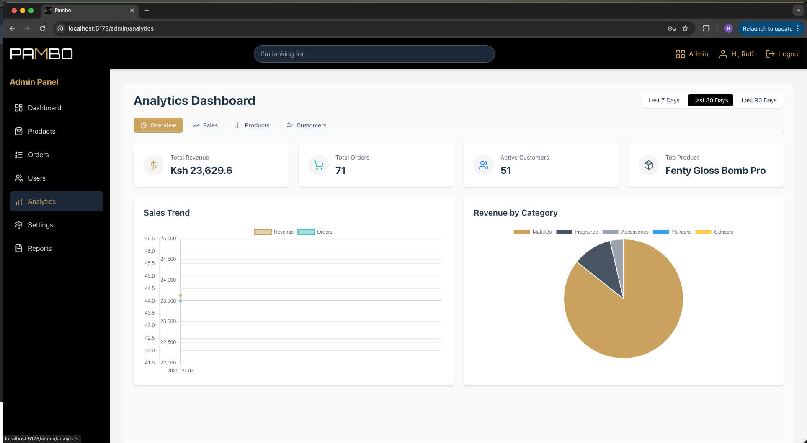

# 🛍️ Pambo Beauty Shop


The Pambo beauty Shop Application is a full-stack e-commerce platform that allows users to browse products, manage their carts, place orders, and track invoices. Admins can manage products view overall performance and manage customers on the platform.

## 🌐 Live Demo

The application is deployed and live. You can access it here:

* **Frontend:** **[PAMBO](https://pambo.onrender.com/)**
* **Backend API:** **[PAMBO](https://group-8-beauty-shop.onrender.com/)**

## ✨ Features  
Below is a breakdown of the system’s core features:  

1. **Register Customer** – New users can create an account.  
2. **Login (Customer/Admin)** – Existing users and admins authenticate securely.  
3. **User Profile** – Customers can manage their personal details and view order history.  
4. **Security Questions** – Users set security questions for added account recovery protection.  
5. **Reset / Forgot Password** – Secure password recovery workflow.  
6. **Add to Cart & Checkout** – Customers can shop and place orders seamlessly.  
7. **Admin Order Management** – Admins can view, approve, or reject orders.  
8. **Admin Analytics** – Dashboard with sales, revenue, and customer insights.  
9. **Admin Reports** – Generate reports for business insights.  
10. **Admin User Management** – Manage customer and admin accounts.  
11. **Admin Products Management** – Add, edit, or remove products in the catalog.  


## User Journeys 
- Registration journey
- Guest User Journey
- Registered User Journey
- Admin Journey  

## 🔐 Registration Journey  

New users can register by providing their details and creating a password. During registration, they also set up **security questions**, which are later used for the **forgot password** flow. If a user forgets their password, they can reset it by correctly answering their security questions, ensuring a secure recovery process.  

  
  


## 👤 Guest User Journey  
Guests begin their shopping experience with a temporary session ID, which tracks their cart and activity. When they register, their session data is seamlessly migrated and tied to a permanent user ID, ensuring no loss of progress.

Guests **MUST** register before completing a purchase, ensuring that all orders and future tracking are associated with a permanent user account.

A **guest user** can:  
1. Browse products.  
2. Add items to the cart.  
3. Proceed to checkout.  

  
  
 

## 🔑 Registered User Journey  
Registered users benefit from a consistent experience across devices, with saved profiles, order history, and faster checkouts.

An **existing user** can:  
1. Log in with their credentials.  
2. Access, edit saved profile and order history.  
3. Add items to the cart.  
4. Proceed directly to checkout.  
5. Track order status in the dashboard.  

   
  

## 🛠️ Admin Journey  
Admins log in with secure credentials and manage the store’s operations. They can add and update products, track and fulfill customer orders, monitor stock, and access sales reports. Admins also handle user management, ensuring smooth operation and accountability across the platform.

All admin actions (product updates, order status changes, and account management) are logged for accountability.

An **admin user** can:  
1. Approve or reject pending orders.  
2. Manage products (create, update, delete).  
3. View analytics dashboards (sales, customers, revenue).  
4. Manage customer accounts and permissions.  

  
  
  
  


## Tools Used

- Frontend: React, Redux Toolkit, TailwindCSS, React Router

- Backend: Flask, SQLAlchemy, Alembic

- Database: PostgreSQL (or SQLite for development)

- Testing: Jest (frontend), Pytest (backend), postman (API)

- CI/CD: Github Actions

- Others: Vite, Axios

## 📡 API Documentation
A list of the available API routes can be found here: [API Routes](server/Routes.md)


## 🛠️ Setup Instructions

### ⚙️ LOCAL SETUP

---

#### 1. Clone the Repository

* **What we’re doing:** Copy the project from GitHub to your local machine.

```bash
git clone git@github.com:Thigzz/Group-8-Beauty-Shop.git
```

#### 2. Navigate into the Project Directory

* **What we’re doing:** Enter the main project folder.

```bash
cd Group-8-Beauty-Shop
```

#### 3. Create a Virtual Environment

* **What we’re doing:** Set up an isolated environment for backend dependencies.

```bash
python3 -m venv venv
```

#### 4. Activate the Virtual Environment

* **What we’re doing:** Turn on the environment so Python uses the correct dependencies.

```bash
source venv/bin/activate  # (Linux/Mac)
venv\Scripts\activate     # (Windows)
```

---

### ⚙️ Backend Setup

---

#### 5. Navigate to the Backend Folder

* **What we’re doing:** Move into the backend directory.

```bash
cd server
```

#### 6. Install Dependencies

* **What we’re doing:** Install all Python dependencies for the backend.

```bash
pip install -r requirements.txt
```

#### 7. Apply Migrations

* **What we’re doing:** Create and apply database tables.

```bash
flask db upgrade
```

#### 8. Seed the Database

* **What we’re doing:** Add starter data for testing.

```bash
flask seed-db
```

#### 9. Run the Backend Server

* **What we’re doing:** Start the Flask backend API.

```bash
flask run
```

Backend runs at: `http://127.0.0.1:5000`

---

### 💻 Frontend Setup

---

#### 1. Navigate to Client Directory

* **What we’re doing:** Move to the frontend folder.

```bash
cd ../client
```

#### 2. Install Dependencies

* **What we’re doing:** Install all necessary frontend packages.

```bash
npm install
```

#### 3. Run the Frontend Server

* **What we’re doing:** Start the local development environment for the frontend.

```bash
npm run dev
```

Frontend runs at: `http://localhost:5173`

---

## 🧪 Running the Application

1. Start the backend (`flask run`)
2. Start the frontend (`npm run dev`)
3. Open your browser at `http://localhost:5173`

---

## 👨‍💻 Authors

| Author                                                                                                                                                                            |
| --------------------------------------------------------------------------------------------------------------------------------------------------------------------------------- |
| [](https://github.com/rsiyoi)               |
| [](https://github.com/Thigzz)             |
| [](https://github.com/justin-0100) |
| [](https://github.com/Simonwarui01)       |

---

## 📸 Image & Asset Credits

All images and icons used are for **educational and demonstration purposes only**. Rights belong to their respective owners.

---

## 🪪 License

**Copyright (c) 2025 Ruth Siyoi, Ike Mwithiga, Justin Kipkorir, Simon Warui**
All rights reserved.

This project is not open source. Unauthorized copying, modification, or distribution is strictly prohibited.

Copyright (c) 2025 Ruth Siyoi, Ike Mwithiga, Justin Kipkorir, Simon Warui  
All rights reserved.  

This project is not open source. Unauthorized copying, modification, or distribution is strictly prohibited.  
